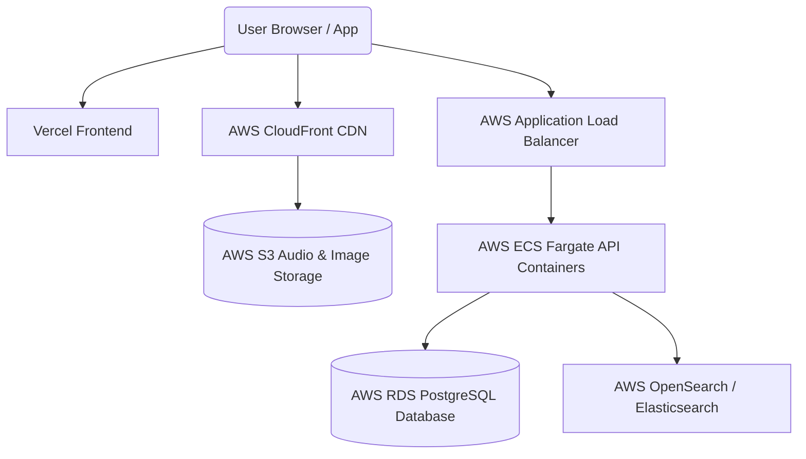

# AWS Deployment Guide - KR Music

This guide covers deploying the KR Music platform to a production-ready, highly available architecture on AWS and Vercel.



---

## 1. Storage & CDN (AWS S3 & CloudFront)

AWS S3 stores raw audio files and cover art. AWS CloudFront is placed in front of S3 to cache and distribute the music streams globally.

### AWS S3 Setup:
1. Create an S3 Bucket: `kr-music-storage`.
2. Disable "Block all public access" (if hosting public album art, or use pre-signed URLs for premium audio downloads).
3. Add a Bucket Policy allowing read accesses:
   ```json
   {
     "Version": "2012-10-17",
     "Statement": [
       {
         "Sid": "PublicReadGetObject",
         "Effect": "Allow",
         "Principal": "*",
         "Action": "s3:GetObject",
         "Resource": "arn:aws:s3:::kr-music-storage/*"
       }
     ]
   }
   ```

### AWS CloudFront Setup:
1. Create a CloudFront Distribution.
2. Set **Origin Domain** to your S3 bucket endpoint.
3. Configure Cache Behavior:
   - Allowed HTTP Methods: `GET, HEAD, OPTIONS`.
   - Restrict Viewer Access: Use **Signed URLs** or **Signed Cookies** if locking audio downloads only to Premium subscribers.
4. Set CORS header policy to allow playback requests from your web domain.

---

## 2. Database (AWS RDS PostgreSQL)

1. Navigate to AWS RDS and create a new database instance.
2. Engine: **PostgreSQL** (version 15+).
3. Templates: **Production** (Multi-AZ for high availability).
4. Credentials: Set master username `postgres` and a strong password.
5. VPC Security Groups: Allow inbound TCP traffic on port `5432` only from the API security group.
6. Enable automatic daily backups.

---

## 3. Backend API (AWS ECS Fargate)

AWS ECS Fargate runs the Express container API without needing to manage EC2 instances.

### Setup Steps:
1. **Dockerize**: Build the Docker container from `backend/Dockerfile` and push it to AWS ECR (Elastic Container Registry).
2. **Task Definition**: Create a Fargate task definition with:
   - CPU: 0.5 vCPU, Memory: 1GB.
   - Environment Variables (linked from AWS Secrets Manager).
3. **ECS Cluster**: Create a Fargate cluster and launch an ECS Service.
4. **Load Balancer**: Create an Application Load Balancer (ALB) routing traffic on HTTP port `80` (redirected to HTTPS port `443`) to the ECS Service task target groups.

---

## 4. Frontend Web (Vercel)

Next.js is natively deployed to Vercel for serverless rendering and high speed edge deliveries.

1. Connect your GitHub repository to Vercel.
2. Set Root Directory to `/web`.
3. Configure Environment Variables:
   - `NEXT_PUBLIC_API_URL`: URL of your AWS Application Load Balancer (e.g. `https://api.krmusic.com`).
4. Click **Deploy**. Vercel will automatically configure build caches, route translations, and custom domains.
